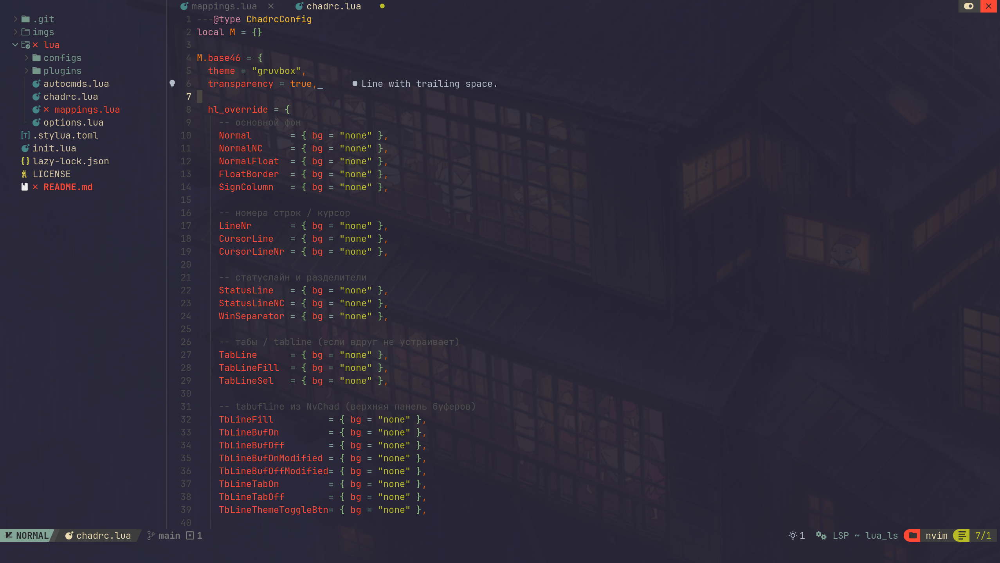
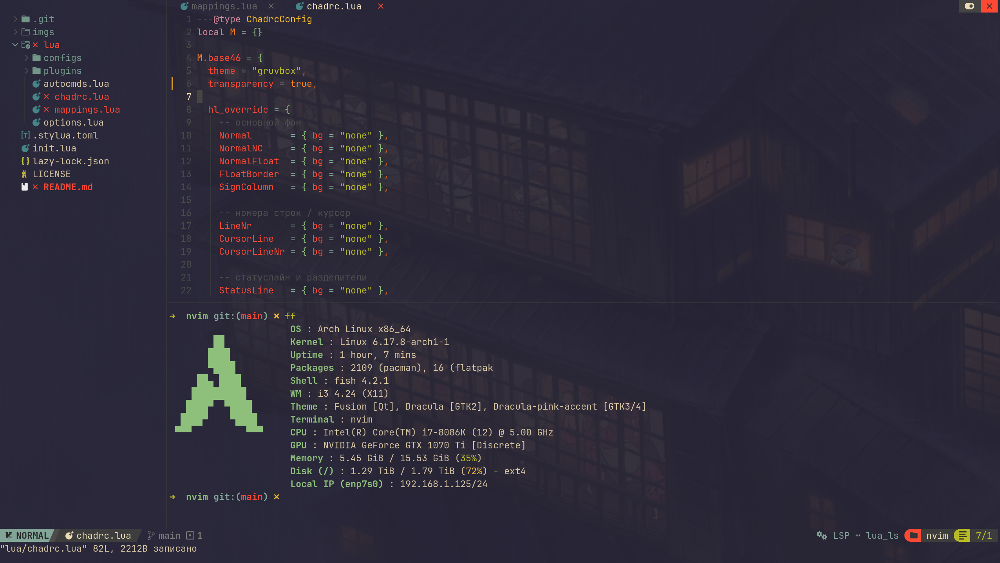
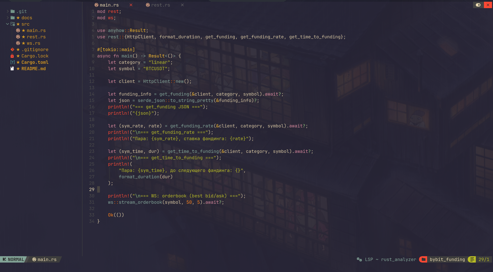
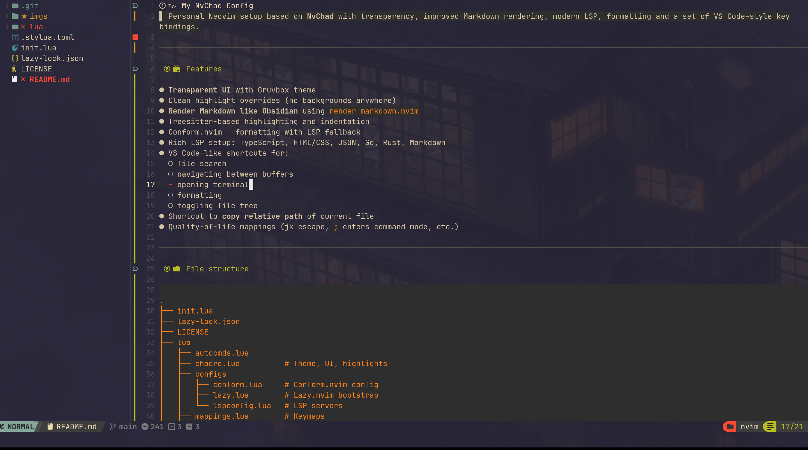
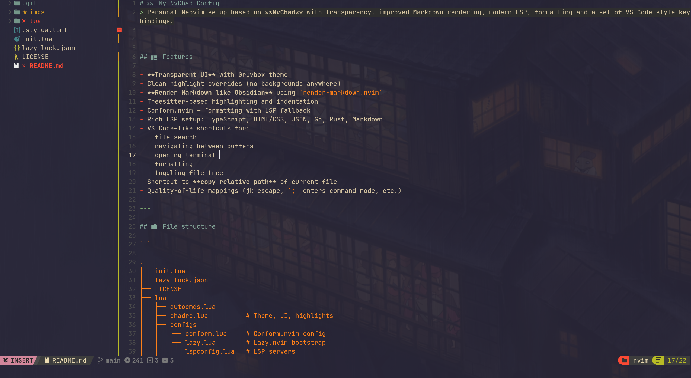

# 💤 My NvChad Config

> Personal Neovim setup based on **NvChad** with transparency, improved Markdown rendering, modern LSP, formatting and a set of VS Code–style keybindings.

## ⚡ Shortcut Cheatsheet

### General

- `;` — command mode (`:`)
- `jk` (insert) — escape
- `<leader>c` — copy relative file path
- `<leader>d` — duplicate current line down

### Files & Buffers

- `Ctrl + p` — find files (ripgrep, like VS Code)
- `Ctrl + b` — toggle file tree (NvimTree)
- `Ctrl + 1..9` — jump to buffer N
- `Ctrl + n` — new buffer
- `Ctrl + w` — close current buffer

## 📦 Features

- **Transparent UI** with Gruvbox theme
- Clean highlight overrides (no backgrounds anywhere)
- **Render Markdown like Obsidian** using `render-markdown.nvim`
- Treesitter-based highlighting and indentation
- Conform.nvim — formatting with LSP fallback
- Rich LSP setup: TypeScript, HTML/CSS, JSON, Go, Rust, Markdown
- VS Code–like shortcuts for:
  - file search
  - navigating between buffers
  - opening terminal
  - formatting
  - toggling file tree
- Shortcut to **copy relative path** of current file
- Quality-of-life mappings (jk escape, `;` enters command mode, etc.)

## 📸 Screenshots

 \
 \
 \
 \


## 📁 File structure

```

.
├── init.lua
├── lazy-lock.json
├── LICENSE
├── lua
│   ├── autocmds.lua
│   ├── chadrc.lua          # Theme, UI, highlights
│   ├── configs
│   │   ├── conform.lua     # Conform.nvim config
│   │   ├── lazy.lua        # Lazy.nvim bootstrap
│   │   └── lspconfig.lua   # LSP servers
│   ├── mappings.lua        # Keymaps
│   ├── options.lua         # Vim options
│   └── plugins
│       └── init.lua        # Plugin list
└── README.md

```

## 🎨 UI & Theme (lua/chadrc.lua)

- Theme: **gruvbox**
- Full transparency (`transparency = true`)
- Global removal of background colors for a clean, wallpaper-friendly UI
- Tweaks for NvimTree, Tabline, statusline, diff highlights, etc.

```lua
M.base46 = {
  theme = "gruvbox",
  transparency = true,
  hl_override = {
    Normal       = { bg = "none" },
    NormalNC     = { bg = "none" },
    NormalFloat  = { bg = "none" },
    FloatBorder  = { bg = "none" },
    SignColumn   = { bg = "none" },
    CursorLine   = { bg = "none" },
    CursorLineNr = { bg = "none" },
    StatusLine   = { bg = "none" },
    WinSeparator = { bg = "none" },
    TabLine      = { bg = "none" },
    TbLineFill   = { bg = "none" },
    NvimTreeNormal = { bg = "none" },
    -- и остальные группы…
  },
}
```

## 🧠 LSP (lua/configs/lspconfig.lua)

Enabled language servers:

- **HTML**
- **CSS**
- **TypeScript/JavaScript** (`tsserver`)
- **JSON**
- **Markdown** (`marksman`)
- **Rust** (`rust_analyzer`)
- **Go** (`gopls`)
- **Python** (optional)

```lua
local servers = {
  "html",
  "cssls",
  "tsserver",
  "jsonls",
  "marksman",
  "rust_analyzer",
  "gopls",
  "pyright",
}

vim.lsp.enable(servers)
```

## 📝 Plugins (lua/plugins/init.lua)

### ✔ Markdown rendering like Obsidian

Uses [`render-markdown.nvim`](https://github.com/MeanderingProgrammer/render-markdown.nvim):

```lua
{
  "MeanderingProgrammer/render-markdown.nvim",
  ft = { "markdown" },
  dependencies = {
    "nvim-treesitter/nvim-treesitter",
    "nvim-tree/nvim-web-devicons",
  },
  opts = {},
}
```

### ✔ Formatting

`conform.nvim`:

```lua
{
  "stevearc/conform.nvim",
  opts = require "configs.conform",
}
```

### ✔ LSP

Loaded separately in `configs/lspconfig.lua`.

## ⌨️ Keybindings (lua/mappings.lua)

### 🟦 General

| Key         | Mode   | Action                   |
| ----------- | ------ | ------------------------ |
| `;`         | normal | Enter command mode (`:`) |
| `jk`        | insert | Escape                   |
| `<leader>c` | normal | Copy relative file path  |

### 📁 File tree

| Key        | Action          |
| ---------- | --------------- |
| `Ctrl + b` | Toggle NvimTree |

### 🔎 Search

| Key        | Action                                |
| ---------- | ------------------------------------- |
| `Ctrl + p` | Find files via ripgrep (like VS Code) |

### 🧵 Buffers

| Key          | Action           |
| ------------ | ---------------- |
| `Ctrl + 1…9` | Jump to buffer N |
| `Ctrl + n`   | New buffer       |
| `Ctrl + w`   | Close buffer     |

### 🛠 Code

| Key                | Action                       |
| ------------------ | ---------------------------- |
| `Ctrl + Shift + I` | Format file via Conform.nvim |

### 🖥 Terminal

| Key        | Action                                        |
| ---------- | --------------------------------------------- |
| `Ctrl + `` | Toggle bottom terminal (NvChad terminal, 30%) |

### 📋 Copy current file path

```lua
map("n", "<leader>c", function()
  local path = vim.fn.expand "%"
  if path == "" then return end

  vim.fn.setreg("+", path)
  vim.fn.setreg("*", path)
  vim.notify("Скопирован путь: " .. path, vim.log.levels.INFO)
end)
```

1. Install **NvChad** (Neovim ≥ 0.9 required):

```bash
git clone https://github.com/NvChad/NvChad ~/.config/nvim --depth 1
```

2. Clone this config on top:

```bash
git clone https://github.com/Avdushin/nvchad-rc ~/.config/nvim/lua/custom
```

3. Launch Neovim:

```bash
nvim
```

Everything will be installed automatically via **lazy.nvim**.

## 🧩 Requirements

- ripgrep (`rg`)
- a Nerd Font (for icons)
- Treesitter parsers (installed automatically)
- Clipboard support (`xclip`/`wl-copy` if Linux)
