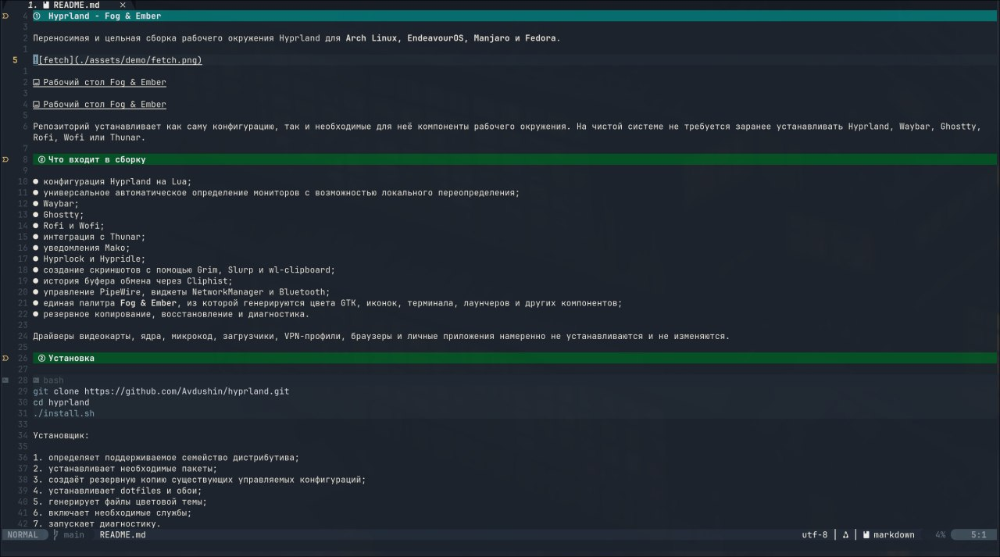
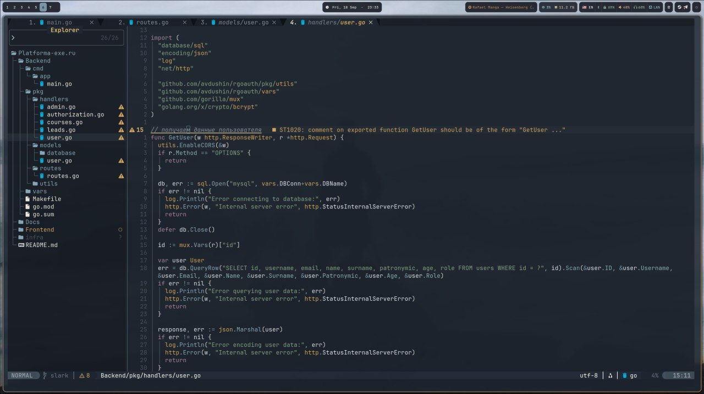
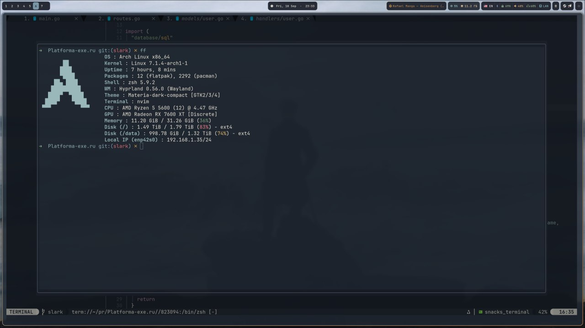
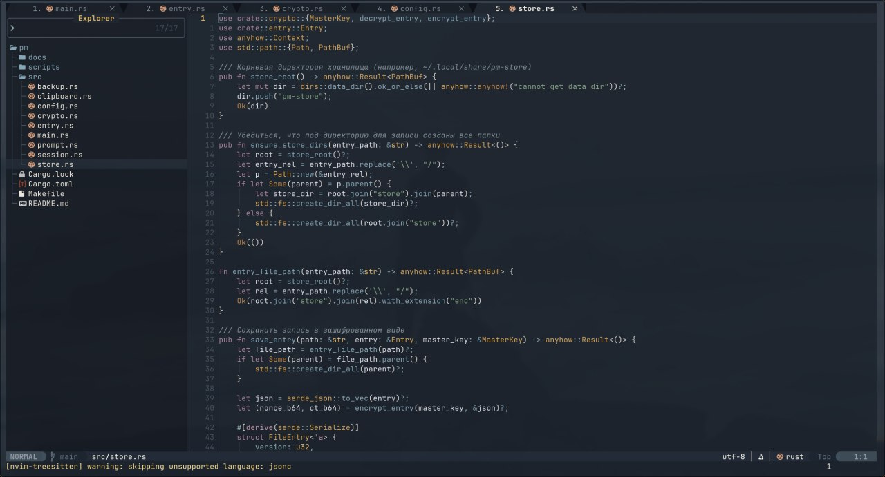
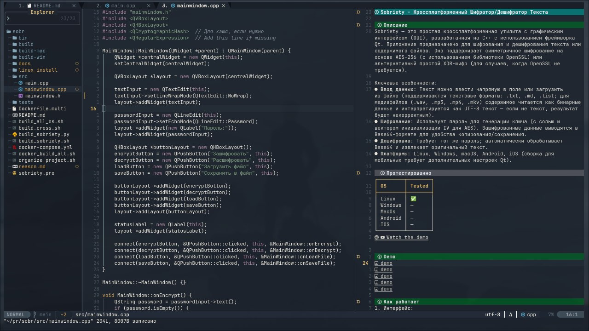
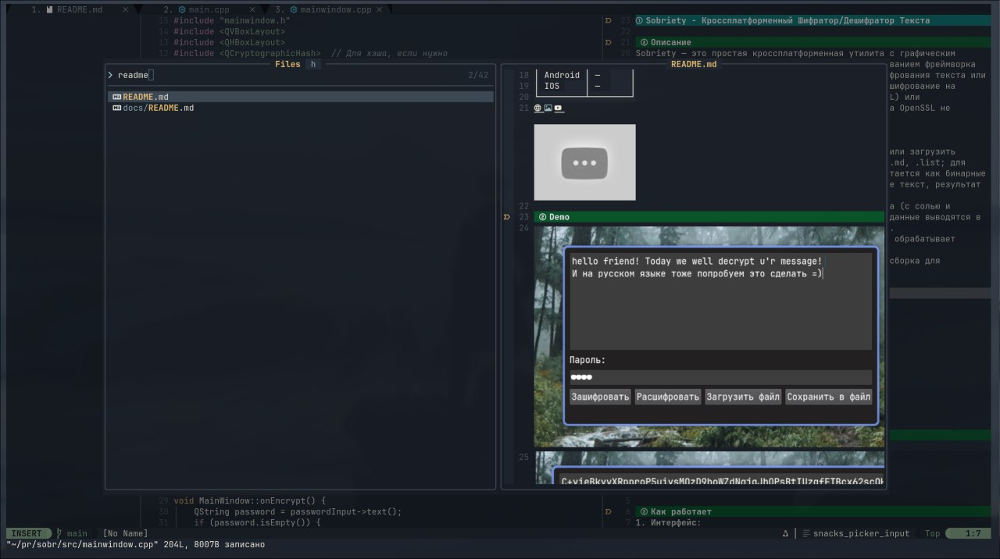

# mine-nvim
My current standalone Neovim configuration.

## Demo

 \
 \
 \
 \
 \



> Historical note: this repository used to contain my NvChad configuration.
> The repository name is kept for continuity, but the current config is a
> standalone profile loaded with `NVIM_APPNAME=mine-nvim`.

## Install

```bash
git clone git@github.com:Avdushin/nvchad-rc.git ~/.config/mine-nvim
NVIM_APPNAME=mine-nvim nvim
```

For a convenient Zsh launcher:

```zsh
n() {
    NVIM_APPNAME=mine-nvim nvim "$@"
}
```

## Main UX

- Fog & Ember colorscheme
- relative line numbers
- wrapped long lines
- Snacks explorer, pickers and terminal
- `Ctrl+B` - toggle explorer
- `Ctrl+H/J/K/L` - move between windows
- `Ctrl+Backtick` - toggle floating terminal
- `Ctrl+Shift+J/K` - add multicursor down/up
- Visual `Tab` / `Shift+Tab` - indent/outdent and keep selection
- Visual surround for quotes and brackets
- `leader+q` - cycle quotes inside parentheses
- `Ctrl+Shift+F` - project search; replacement workflow via GrugFar
- `leader+w...` - window management

### Ghostty note

Ghostty uses `Ctrl+Shift+J` for screen capture by default. To let Neovim receive
that key for multicursor-down, put this in `~/.config/ghostty/config`:

```ini
keybind = ctrl+shift+j=unbind
```

The exact plugin revisions are pinned in `lazy-lock.json`.
