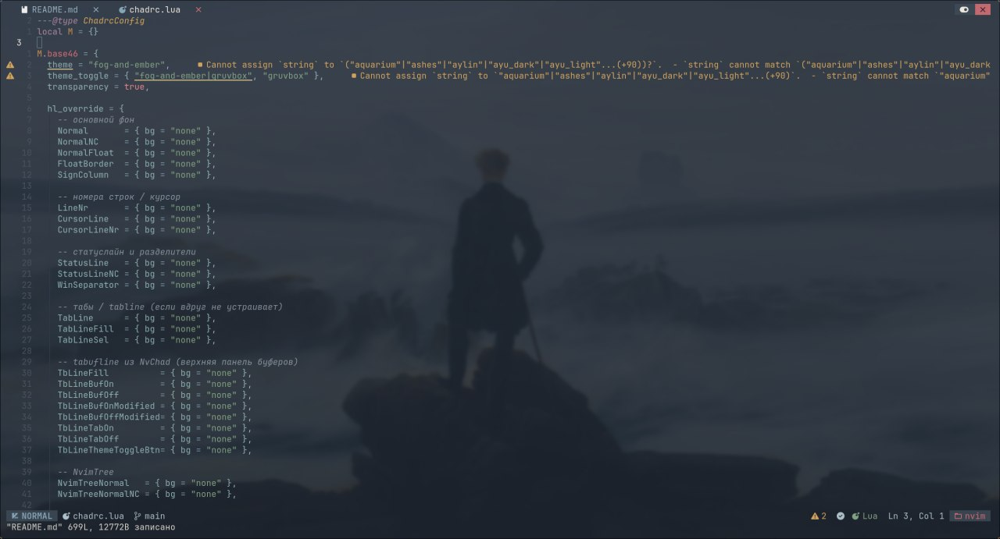
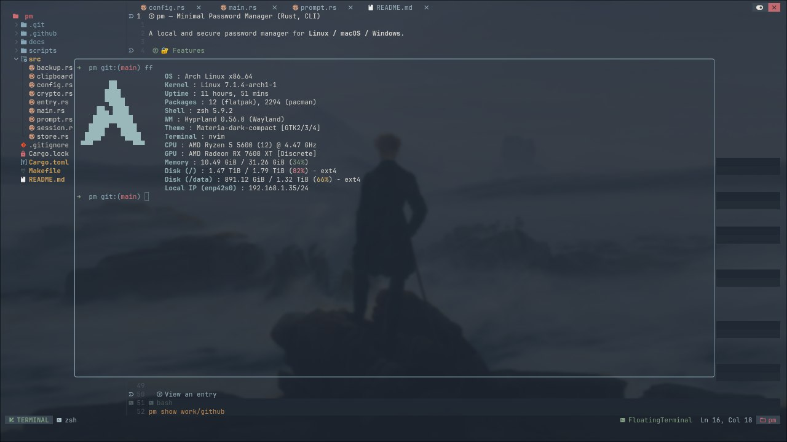
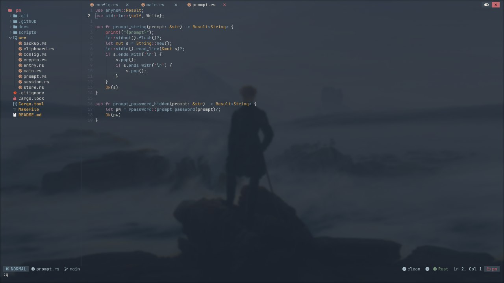
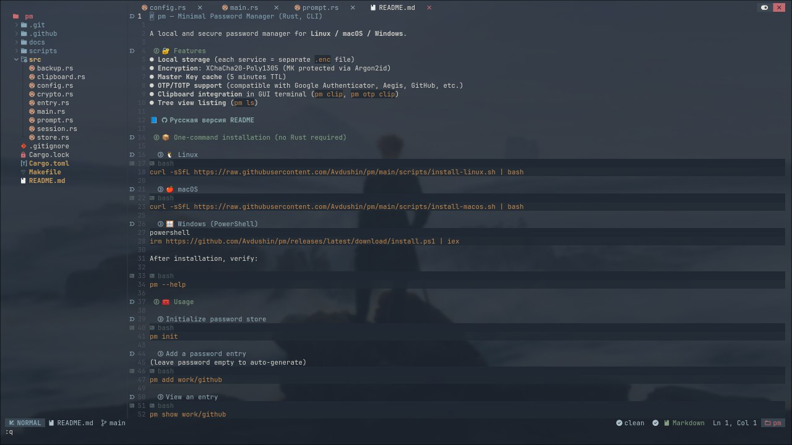
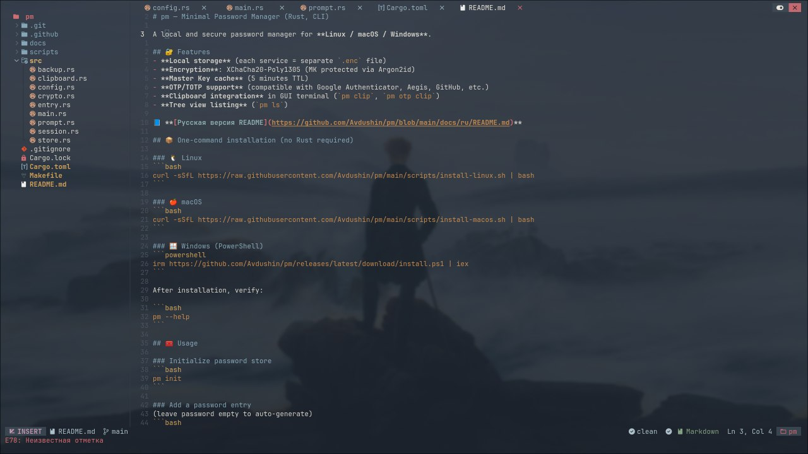
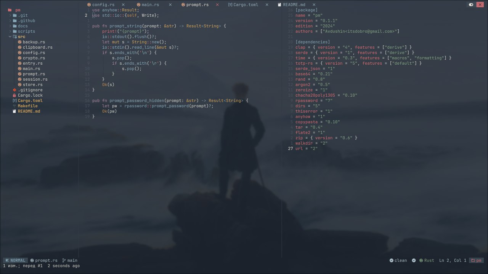

# 💤 My NvChad Config

Personal Neovim setup based on **NvChad v2.5**, focused on a fast keyboard-driven workflow with a number of VS Code–style conveniences.

The config includes:

- transparent UI with the custom **Fog & Ember** theme
- Gruvbox theme toggle
- LSP for web development, Go, Rust, Python and Markdown
- Emmet support
- formatting with Conform
- VS Code–style file search, project search and multicursor
- persistent split and floating terminals
- NvimTree file explorer
- Markdown rendering and inline image support
- custom split management
- Russian keyboard layout support
- custom surround behavior
- lightweight Markdown notes workflow


## 📸 Screenshots













## 🚀 Quick Start

### Linux / macOS — one-command install

```bash
curl -fsSL https://raw.githubusercontent.com/Avdushin/nvchad-rc/main/install.sh | bash
```

The installer will:

- detect Linux or macOS
- install required system packages
- backup an existing `~/.config/nvim`
- clone this repository
- install/sync plugins with `lazy.nvim`
- install configured LSP servers with Mason

Then:

```bash
nvim
```

> The automatic installer currently supports Arch Linux, Debian/Ubuntu,
> Fedora and macOS with Homebrew.

### Manual / Windows installation

Clone the config:

```bash
git clone https://github.com/Avdushin/nvchad-rc ~/.config/nvim
```

Start Neovim:

```bash
nvim
```

Sync plugins:

```vim
:Lazy sync
```

Update Mason registry and install LSP servers:

```vim
:MasonUpdate
:MasonInstall html-lsp css-lsp typescript-language-server json-lsp marksman rust-analyzer gopls pyright emmet-language-server
```

Restart Neovim and verify:

```vim
:checkhealth
:checkhealth vim.lsp
:LspInfo
```

Useful maintenance commands:

```vim
:Lazy update
:Mason
:MasonUpdate
```

## ⚡ Shortcut Cheatsheet

`<leader>` is `Space`.

### General

| Key | Mode | Action |
| --- | --- | --- |
| `;` | Normal | Enter command mode (`:`) |
| `jk` | Insert | Escape to Normal mode |
| `Ctrl + S` | Normal / Insert | Save file |
| `gd` | Normal | Go to definition |
| `u` | Normal | Undo |
| `Ctrl + R` | Normal | Redo |
| `<leader>c` | Normal | Copy relative file path |
| `<leader>d` | Normal | Duplicate current line |
| `Ctrl + Shift + ↑/↓` | Normal / Insert / Visual | Move line or selection |

Useful native Vim commands:

| Key | Action |
| --- | --- |
| `gf` | Open file under cursor |
| `Ctrl + O` | Jump back |
| `Ctrl + I` | Jump forward |


## 📁 Files & Buffers

| Key | Action |
| --- | --- |
| `Ctrl + P` | Find files with Telescope + ripgrep |
| `Ctrl + B` | Toggle NvimTree |
| `Ctrl + 1..9` | Jump to buffer 1–9 |
| `Ctrl + N` | Create a new buffer |
| `Ctrl + W` | Close current buffer |

`Ctrl + W` is intentionally remapped from the default Vim window prefix to behave more like closing a tab in VS Code.

### NvimTree

Some useful default NvimTree bindings:

| Key | Action |
| --- | --- |
| `a` | Create file / directory |
| `r` | Rename |
| `d` | Delete |
| `c` | Copy |
| `x` | Cut |
| `p` | Paste |
| `V` + `j/k` | Select multiple consecutive entries |
| `g?` | Show NvimTree help |

Create a directory by ending the name with `/`:

```text
src/
```

Or create nested paths directly:

```text
src/components/Button.tsx
```


## 🪟 Splits

### Create splits

| Key | Action |
| --- | --- |
| `<leader>v` | Vertical split |
| `<leader>h` | Horizontal split |

### Navigate between splits

Inherited from NvChad:

| Key | Action |
| --- | --- |
| `Ctrl + H` | Move left |
| `Ctrl + J` | Move down |
| `Ctrl + K` | Move up |
| `Ctrl + L` | Move right |

### Resize splits

| Key | Action |
| --- | --- |
| `<leader>→` | Increase width |
| `<leader>←` | Decrease width |
| `<leader>↓` | Increase height |
| `<leader>↑` | Decrease height |
| `<leader>=` | Equalize all splits |


## 🔎 Search & Replace

### Current file

```text
Ctrl + F
```

Opens standard Vim search.

### Find files

```text
Ctrl + P
```

Uses Telescope with `ripgrep`, including hidden files except `.git`.

### Project-wide search & replace

Powered by [`grug-far.nvim`](https://github.com/MagicDuck/grug-far.nvim).

| Key | Action |
| --- | --- |
| `Ctrl + Shift + F` | Search & replace in project |
| `<leader>sr` | Search & replace in project |
| `<leader>sf` | Search & replace in current file |
| `<leader>sw` | Search word under cursor in project |

The search root is resolved automatically:

1. Git repository root
2. current file directory when outside Git
3. current working directory for unnamed buffers


## 🧵 Multicursor

Powered by [`vim-visual-multi`](https://github.com/mg979/vim-visual-multi).

The mappings are intentionally close to VS Code / Sublime Text.

| Key | Action |
| --- | --- |
| `Ctrl + D` | Select word / next occurrence |
| `Alt + D` | Select previous occurrence |
| `Alt + J` | Add cursor below |
| `Alt + K` | Add cursor above |

Example:

```text
user
user
user
```

Place the cursor on the first `user` and press:

```text
Ctrl+D
Ctrl+D
Ctrl+D
```

Then edit all selected occurrences simultaneously.


## 🛠 Formatting

Formatting is handled by [`conform.nvim`](https://github.com/stevearc/conform.nvim), with LSP fallback where appropriate.

```text
Ctrl + Shift + I
```

formats the current buffer.


## 🧠 LSP

LSP configuration lives in:

```text
lua/configs/lspconfig.lua
```

Currently enabled servers:

| Language / Feature | Neovim LSP config | Mason package |
| --- | --- | --- |
| HTML | `html` | `html-lsp` |
| CSS / SCSS / Less | `cssls` | `css-lsp` |
| JavaScript / TypeScript | `ts_ls` | `typescript-language-server` |
| JSON | `jsonls` | `json-lsp` |
| Markdown | `marksman` | `marksman` |
| Rust | `rust_analyzer` | `rust-analyzer` |
| Go | `gopls` | `gopls` |
| Python | `pyright` | `pyright` |
| Emmet | `emmet_language_server` | `emmet-language-server` |

Current configuration:

```lua
local servers = {
  "html",
  "cssls",

  "ts_ls",
  "jsonls",
  "marksman",

  "rust_analyzer",
  "gopls",
  "pyright",
  "emmet_language_server",
}

vim.lsp.enable(servers)
```

### Important: Mason does not install servers automatically

Running:

```vim
:Mason
```

only opens the Mason package manager UI.

Likewise:

```lua
vim.lsp.enable(...)
```

enables an LSP configuration but does **not** download the corresponding executable.

After a fresh installation, install the required servers with:

```vim
:MasonInstall html-lsp css-lsp typescript-language-server json-lsp marksman rust-analyzer gopls pyright emmet-language-server
```

You can inspect installed tools with:

```vim
:Mason
```

and diagnose LSP configuration with:

```vim
:checkhealth vim.lsp
```

For the current buffer:

```vim
:LspInfo
```


## ⚡ Emmet

Emmet is provided through `emmet-language-server`.

Examples:

```text
.header
```

can expand to:

```html
<div class="header"></div>
```

and:

```text
ul>li*3
```

to:

```html
<ul>
  <li></li>
  <li></li>
  <li></li>
</ul>
```

Check whether the server is available:

```vim
:echo executable('emmet-language-server')
```

Expected result:

```text
1
```


## 🖥 Terminals

The setup has three terminal layouts.

| Key | Action |
| --- | --- |
| `Ctrl + \`` | Toggle persistent bottom terminal |
| `Ctrl + E` | Toggle right vertical terminal |
| `Ctrl + Shift + T` | Toggle persistent floating terminal |
| `<leader>tt` | Toggle persistent floating terminal |

The bottom and floating terminals preserve their shell session while being hidden.


## 📝 Markdown

### Rendered Markdown

[`render-markdown.nvim`](https://github.com/MeanderingProgrammer/render-markdown.nvim) provides an Obsidian-like Markdown view.

### Images

Markdown images are rendered through [`image.nvim`](https://github.com/3rd/image.nvim).

The current configuration uses:

```lua
backend = "kitty"
processor = "magick_cli"
```

Useful mappings:

| Key | Action |
| --- | --- |
| `<leader>mi` | Toggle Markdown images |
| `<leader>mI` | Show `image.nvim` diagnostic report |

A terminal supporting the Kitty graphics protocol is recommended.

ImageMagick is required for `magick_cli`.


## 📝 Notes

The config includes a small built-in Markdown notes workflow.

Default notes directory:

```text
~/Workspace/notes
```

Available commands:

```vim
:Draft
:Note
:Notes
:Scratch
:ClipEdit
```

Mappings:

| Key | Action |
| --- | --- |
| `<leader>nd` | Open `draft.md` |
| `<leader>nn` | Create a timestamped note |
| `<leader>nf` | Find notes with Telescope |
| `<leader>ns` | Open temporary Markdown scratch buffer |
| `<leader>nc` | Edit system clipboard in a temporary buffer |

Notes inside `~/Workspace/notes` are automatically saved on buffer leave, focus loss and leaving Insert mode.


## ✨ Surround

The setup includes [`nvim-surround`](https://github.com/kylechui/nvim-surround) plus custom Visual-mode wrapping.

Select text with `v` and press one of:

```text
"
'
`
(
[
{
<
```

For example:

```text
hello world
```

select it and press `"`:

```text
"hello world"
```

Press `"` again while the original text remains selected:

```text
""hello world""
```

and again:

```text
"""hello world"""
```

Linewise Visual mode (`Shift + V`) is also supported for multiline wrappers.


## 🇷🇺 Russian keyboard layout

Normal/Visual mode commands are mapped through `langmap`, so common Vim commands continue to work when the Russian keyboard layout is active.

For example, physical keys corresponding to:

```text
w
gd
yy
<leader>sr
```

continue to behave as their English-layout counterparts.

`Ctrl+A..Z` and `Ctrl+Shift+A..Z` are additionally mirrored for Russian physical keys where supported by the terminal.


## 🎨 UI & Theme

Default theme:

```text
Fog & Ember
```

Alternative theme:

```text
Gruvbox
```

Toggle them with:

```text
<leader>ut
```

The UI is configured with full transparency:

```lua
M.base46 = {
  theme = "fog-and-ember",
  theme_toggle = { "fog-and-ember|gruvbox", "gruvbox" },
  transparency = true,
}
```

Backgrounds are removed from the main editor, floating windows, statusline, tabufline, NvimTree and several auxiliary highlight groups.

The statusline uses the custom:

```text
vscode_colored
```

layout with Git, LSP, diagnostics, language, cursor position and working directory information.


## 🔌 Main Plugins

The configuration is based on NvChad and additionally uses:

- [`nvim-treesitter`](https://github.com/nvim-treesitter/nvim-treesitter)
- [`nvim-lspconfig`](https://github.com/neovim/nvim-lspconfig)
- [`conform.nvim`](https://github.com/stevearc/conform.nvim)
- [`render-markdown.nvim`](https://github.com/MeanderingProgrammer/render-markdown.nvim)
- [`image.nvim`](https://github.com/3rd/image.nvim)
- [`vim-visual-multi`](https://github.com/mg979/vim-visual-multi)
- [`nvim-surround`](https://github.com/kylechui/nvim-surround)
- [`grug-far.nvim`](https://github.com/MagicDuck/grug-far.nvim)
- [`cmp-tabnine`](https://github.com/tzachar/cmp-tabnine)
- Telescope
- NvimTree
- nvim-cmp
- which-key.nvim

The `nvim-treesitter` configuration intentionally uses the legacy `master` branch and is pinned for compatibility with the current NvChad v2.5 setup.


## 📁 File Structure

```text
.
├── init.lua
├── lazy-lock.json
├── LICENSE
├── README.md
├── imgs/
└── lua/
    ├── autocmds.lua
    ├── bottom_terminal.lua
    ├── chadrc.lua
    ├── floating_terminal.lua
    ├── mappings.lua
    ├── notes.lua
    ├── options.lua
    ├── osc52.lua
    ├── russian_keymap.lua
    ├── statusline.lua
    ├── visual_surround.lua
    ├── configs/
    │   ├── conform.lua
    │   ├── lazy.lua
    │   └── lspconfig.lua
    ├── plugins/
    │   ├── cmp_arrows.lua
    │   ├── grug-far.lua
    │   ├── init.lua
    │   ├── nvimtree.lua
    │   ├── tabnine.lua
    │   ├── treesitter_compat.lua
    │   └── which-key.lua
    └── themes/
        └── fog-and-ember.lua
```


## 🚀 Installation

This repository is a complete Neovim configuration.

You do **not** need to clone NvChad separately into `~/.config/nvim`.

### 1. Backup an existing config

```bash
mv ~/.config/nvim ~/.config/nvim.bak-$(date +%Y%m%d-%H%M%S)
```

Optionally back up Neovim state/data as well:

```bash
mv ~/.local/share/nvim ~/.local/share/nvim.bak-$(date +%Y%m%d-%H%M%S)
mv ~/.local/state/nvim ~/.local/state/nvim.bak-$(date +%Y%m%d-%H%M%S)
```

### 2. Clone the config

```bash
git clone https://github.com/Avdushin/nvchad-rc ~/.config/nvim
```

### 3. Start Neovim

```bash
nvim
```

`lazy.nvim` will bootstrap itself and install the configured Neovim plugins.

### 4. Install LSP servers

Inside Neovim:

```vim
:MasonInstall html-lsp css-lsp typescript-language-server json-lsp marksman rust-analyzer gopls pyright emmet-language-server
```

Restart Neovim after installation.


## 🧩 Requirements

Recommended system dependencies:

```text
git
neovim
ripgrep
nodejs
npm
imagemagick
a Nerd Font
```

For Linux clipboard integration, install an appropriate clipboard provider, for example:

```text
wl-clipboard    # Wayland
xclip           # X11
```

For Markdown image rendering, use a terminal that supports the Kitty graphics protocol, such as Ghostty or Kitty.

Some language-specific features may also require their respective toolchains.


## 🔧 Maintenance

Update plugins:

```vim
:Lazy update
```

Open Mason:

```vim
:Mason
```

Update the Mason registry:

```vim
:MasonUpdate
```

Check Neovim health:

```vim
:checkhealth
```

Check LSP health:

```vim
:checkhealth vim.lsp
```
